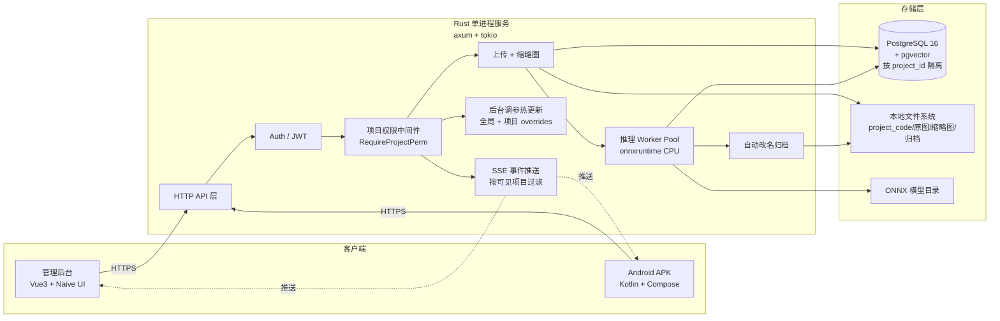
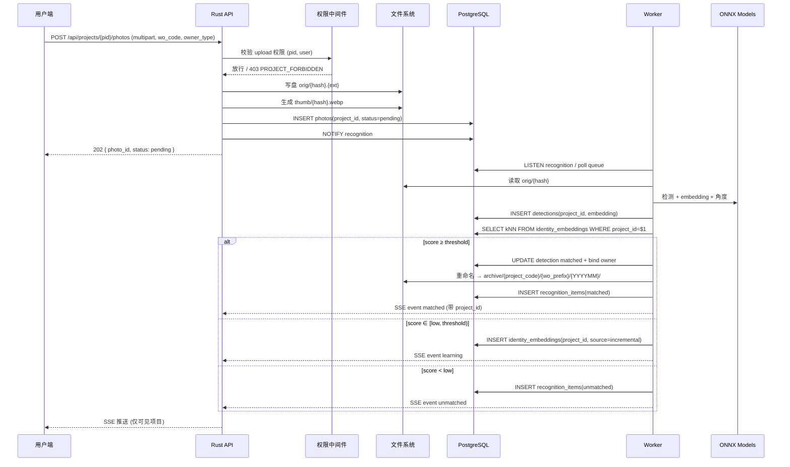

# 架构设计

> 本文描述 F1-Photo 的总体架构、组件职责、数据流与部署拓扑。
>
> v2 说明：业务结构为「项目 → 工单 → 人员/工具/设备 → 照片」。项目级 RBAC 详见 [permissions.md](permissions.md)。

## 1. 总体拓扑



## 2. 分层说明

### 接入层

- **Web 后台**（admin / 项目成员）：项目切换器、上传、查询、识别条目纠错、后台调参、项目/成员管理、APK 发布。
- **Android APK**（现场人员）：登录 → 选项目 → 拍照上传 / 工单查询 / 识别结果查看 / 版本自检。

### 服务层（Rust 单进程）

- **HTTP API**：axum router，统一 JSON 响应体，错误中间件拦截。
- **Auth**：Argon2 密码哈希 + JWT，**关闭开放注册**，只能后台创建账号。全局角色：`admin / member`。
- **项目权限中间件**：`RequireProjectPerm(view|upload|delete|manage)` extractor。从路径拿 `project_id`，查 `project_members` 判断是否有所需权限位；admin 跳过检查。
- **上传**：`multipart/form-data` 流式写盘 + 哈希去重（项目内）+ WebP 缩略图。
- **推理 Worker Pool**：`tokio::task` + Semaphore 限并发，默认 = `min(CPU/2, 8)`；kNN 查询强制带 `project_id`。
- **自动改名归档**：路径以 `project_code` 开头，防跨项目同名工单冲突。
- **Settings**：全局 `settings(key, value jsonb)` + `projects.overrides`，订阅广播热更新。
- **SSE**：`/api/events?token=...` 长连接，按用户可见项目过滤推送。

### 存储层

- **PostgreSQL 16 + pgvector**：所有业务表 `project_id NOT NULL`；`identity_embeddings` HNSW 全局，kNN 查询前置 `project_id + owner_type` 过滤。
- **本地文件系统**：原图 `data/orig/`，缩略图 `data/thumb/`，归档 `data/archive/{project_code}/{wo_code_prefix}/{YYYYMM}/`，人工识别预览 `data/annotated/`。
- **ONNX 模型**：`models/`，部署时复制。

## 3. 上传 + 识别数据流



## 4. 决策逻辑抽象

```mermaid
flowchart TD
    Start([拿到 detection]) --> Q{在 identity_embeddings\nkNN 查询\n(project_id 过滤)}
    Q --> S[拿到 top1 score]
    S --> A{score ≥ threshold?}
    A -- 是 --> M[matched\n绑定身份 + 归档]
    A -- 否 --> B{score ≥ low?}
    B -- 是 --> L[learning\n增量存一条 embedding\n同 project_id]
    B -- 否 --> U[unmatched\n进人工队列]
    M --> P{匹配度 ∈ [threshold, 0.95)?}
    P -- 是 --> L2[额外存一条 “不匹配那 10%” embedding]
    P -- 否 --> End([结束])
    L --> End
    U --> End
    L2 --> End
```

## 5. 并发与资源

- HTTP 进程：1 个，axum + tokio，默认 worker = CPU 核数。
- 推理任务并发：`min(CPU/2, 8)`（默认 8）。
- onnxruntime intra-op = 2，inter-op = 1（为并发留出 CPU）。
- 内存预期：推理期间峰值 < 6GB（人脸 + 工具 + DINOv2 同时加载）。
- DB 连接池：32。
- 项目隔离对吞吐影响可忽略：HNSW 候选集上的 `project_id` 过滤代价极小。

## 6. 项目目录详解

```
F1-photo/
├── server/
│   ├── Cargo.toml
│   ├── build.rs                  # 嵌入 git rev / 版本号
│   ├── migrations/               # sqlx-migrate (含 projects / project_members)
│   └── src/
│       ├── main.rs
│       ├── config.rs             # 启动参数 + .env
│       ├── logging.rs            # tracing-subscriber
│       ├── error.rs              # AppError + IntoResponse
│       ├── db/                   # sqlx pool, listen/notify
│       ├── api/                  # axum routes
│       │   ├── mod.rs
│       │   ├── auth.rs
│       │   ├── users.rs              # admin 用户管理
│       │   ├── projects.rs           # 项目 CRUD
│       │   ├── members.rs            # 项目成员 + 权限位
│       │   ├── work_orders.rs
│       │   ├── persons.rs
│       │   ├── tools.rs
│       │   ├── devices.rs
│       │   ├── photos.rs
│       │   ├── recognition.rs        # 识别条目 + 纠错
│       │   ├── settings.rs           # 全局 + 项目 overrides
│       │   ├── packaging.rs          # 打包下载
│       │   ├── versions.rs           # APK 版本
│       │   └── sse.rs
│       ├── auth/                 # argon2 + JWT
│       ├── permissions/          # RequireProjectPerm extractor + helpers
│       ├── upload/               # multipart, hash, thumb
│       ├── recognition/
│       │   ├── mod.rs
│       │   ├── ort.rs                # onnxruntime 封装
│       │   ├── face.rs               # SCRFD + ArcFace
│       │   ├── object.rs             # YOLOv8n
│       │   ├── embed.rs              # DINOv2
│       │   ├── angle.rs              # heuristic / MobileNetV3
│       │   ├── matcher.rs            # pgvector kNN (按 project_id) + 决策
│       │   └── worker.rs
│       ├── archive/              # 重命名 + 移动（带 project_code）
│       ├── settings/
│       ├── packaging/            # zip 导出（项目内）
│       ├── sse/
│       └── versioning/
├── web/
│   ├── package.json
│   ├── vite.config.ts
│   ├── tailwind.config.ts
│   └── src/
│       ├── main.ts
│       ├── router/
│       ├── stores/                # pinia (含 currentProject)
│       ├── api/                   # axios + 调用封装
│       ├── components/
│       │   └── ProjectSwitcher.vue   # 顶栏项目切换器
│       └── pages/
│           ├── Login.vue
│           ├── Dashboard.vue
│           ├── Projects.vue           # admin: 项目管理
│           ├── ProjectMembers.vue     # admin/manage: 成员 + 权限位
│           ├── WorkOrders.vue
│           ├── Persons.vue
│           ├── Tools.vue
│           ├── Devices.vue
│           ├── Photos.vue
│           ├── RecognitionItems.vue   # 识别条目人工纠错
│           ├── Settings.vue           # 全局 + 项目级调参
│           └── AppVersions.vue        # APK 发布
├── android/
│   └── app/                       # Compose UI（含项目选择页）
├── models/
├── deploy/
│   ├── install_linux.sh
│   ├── install_windows.ps1
│   ├── systemd/
│   └── nssm/
├── tools/training/                # 仅研发机使用
│   ├── README.md
│   ├── requirements.txt
│   ├── prepare_dataset.py
│   ├── train_angle.py
│   ├── export_onnx.py
│   └── quantize_int8.py
└── docs/
```

## 7. 部署拓扑

```mermaid
flowchart TB
    subgraph Linux[Linux 部署]
        sys[(systemd)]
        sys --> rs[f1-photo (Rust bin)]
        sys --> pg[postgres (便携)]
    end
    subgraph Win[Windows 部署]
        nssm[NSSM]
        nssm --> rsw[f1-photo.exe]
        nssm --> pgw[postgres.exe]
    end
    rs --> pg
    rsw --> pgw
```

- 依赖 0 个外部网络。
- 默认端口：HTTP `8080`，PG `5544`。
- 部署后 `curl http://127.0.0.1:8080/healthz` 验证。
- 首次启动迁移会创建 `default` 项目 + 绑定 admin。

## 8. 可观测性

- `tracing` 库输出 JSON 日志，默认写入 `logs/server.log`；每条请求日志含 `user_id`、`project_id`、`route`。
- `/healthz`：进程存活。
- `/readyz`：DB 连通 + 模型加载完成。
- `/metrics` (可选)：Prometheus exposition。
- 指标：上传延迟、推理队列长度、各模型推理耗时、kNN 未命中率、unmatched 积压、**按项目维度**各项指标。
