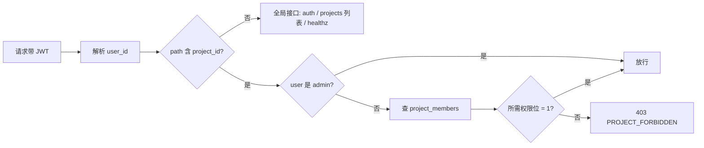

# 权限与项目隔离

## 1. 总览

在原结构「工单 → 人员/工具」之上加一层 **项目 (Project)**：

```
项目 (Project) → 工单 (Work Order) → 人员 / 工具 / 设备 → 照片
```

每个项目是一个**独立的数据空间**：工单、人员、工具、设备、照片、特征值库 (`identity_embeddings`) 全部按 `project_id` 隔离。两个项目里同名的「张三」是完全不同的实体，匹配时不会串项目。

## 2. 角色模型

### 2.1 全局角色 (`user_role`)

| 角色 | 说明 |
|---|---|
| `admin`  | 超级管理员。可创建/删除项目；无视项目成员身份直接访问所有项目；管理用户、APK、全局设置。 |
| `member` | 普通账号。必须通过 `project_members` 加入项目才能看到任何项目数据；未加入的项目完全不可见。 |

旧的 `operator / viewer` 全部归入「项目内权限」，全局只保留 `admin / member` 两种。

### 2.2 项目内权限 (`project_members`)

每条记录 `(project_id, user_id, can_view, can_upload, can_delete, can_manage)`：

| 权限位 | 含义 |
|---|---|
| `can_view`   | 读项目所有数据（工单 / 人员 / 工具 / 设备 / 照片 / 识别条目）。 |
| `can_upload` | 上传照片；创建/修改工单/人员/工具/设备；对识别条目做绑定/纠错。 |
| `can_delete` | 删除项目内的工单/人员/工具/设备/照片。 |
| `can_manage` | 改项目元数据；增删成员；调本项目级阈值。 |

设计要点：

- 4 个权限位独立可组合。例：
  - 只读账号：`view=1, upload=0, delete=0, manage=0`
  - 现场拍照：`view=1, upload=1, delete=0, manage=0`
  - 项目主管：`view=1, upload=1, delete=1, manage=1`
- 全部为 0 等价于「不是成员」，不应入库。
- `manage` 不自动包含 `delete`：可以管成员但不能直接删数据。

## 3. 两种使用模式

用同一套机制覆盖你提的两种场景：

### 3.1 独立空间模式
后台为每个账号 / 每个班组建一个独立项目，把对应账号加入。账号 A 在项目 A 上传的照片，账号 B 在项目 B 完全看不见。

### 3.2 共享空间模式
后台建一个共用项目，把多个账号都加进来，按需配置每人 4 个权限位：

- 经理：`1/1/1/1`
- 现场：`1/1/0/0`
- 审计：`1/0/0/0`

### 3.3 混合
一个账号可以同时是多个项目成员，每个项目内权限独立。前端登录后调 `/api/projects` 拿可访问列表，所有页面带「项目切换器」。

## 4. 数据隔离边界

**按项目隔离**的表：

- `work_orders` / `persons` / `tools` / `devices` / `photos`
- `identity_embeddings`（关键：特征向量按项目隔离，跨项目不匹配）
- `recognition_items` / `recognition_queue`
- `detections`（denorm `project_id`，便于查询）

**全局**的表：

- `users` / `audit_log` / `app_versions`
- `settings`（全局默认；项目可在 `projects.overrides JSONB` 里覆盖阈值/上传上限）

唯一约束相应改成复合：

- `work_orders (project_id, code)` UNIQUE
- `persons (project_id, employee_no)` UNIQUE
- `tools (project_id, sn)` UNIQUE
- `devices (project_id, sn)` UNIQUE

这样两个项目里都可以有 `WO-001`、`张三`、同一型号的工具序号。

## 5. 鉴权流程



实现：axum extractor `RequireProjectPerm(perm)`，从 path 拿 `project_id`，从 JWT 拿 `user_id`，查 `project_members`：

- 列表/读取 → `view`
- 上传/创建/绑定/纠错 → `upload`
- 删除 → `delete`
- 项目设置 + 成员管理 → `manage`

SSE 事件流按用户可见项目集合过滤，不串发。

## 6. API 影响（详见 api.md）

业务接口路径前缀加 `project_id`：

```
GET    /api/projects/{pid}/work_orders
POST   /api/projects/{pid}/photos
GET    /api/projects/{pid}/persons
GET    /api/projects/{pid}/recognition_items
...
```

新增项目管理接口：

| Method | Path | 权限 |
|---|---|---|
| `GET`    | `/api/projects` | 自动按可见项目过滤（admin 可加 `?all=1`） |
| `POST`   | `/api/projects` | admin |
| `PATCH`  | `/api/projects/{pid}` | manage |
| `DELETE` | `/api/projects/{pid}` | admin |
| `GET`    | `/api/projects/{pid}/members` | view |
| `POST`   | `/api/projects/{pid}/members` | manage / admin |
| `PATCH`  | `/api/projects/{pid}/members/{uid}` | manage / admin |
| `DELETE` | `/api/projects/{pid}/members/{uid}` | manage / admin |

## 7. 文件归档与项目隔离

归档路径增加项目前缀：

```
data/archive/{project_code}/{wo_code_prefix3}/{YYYYMM}/{wo_code}_{owner}_{angle}_{seq:03}.{ext}
```

打包下载（zip）也按项目隔离；非 admin 的用户无法跨项目打包。

## 8. 识别匹配的项目作用域

kNN 强制带 `project_id`：

```sql
SELECT owner_type, owner_id, 1 - (embedding <=> $1) AS score
FROM identity_embeddings
WHERE project_id = $2
  AND owner_type = $3
ORDER BY embedding <=> $1
LIMIT 5;
```

效果：

- 「项目 A 张三」和「项目 B 张三」不会互相误匹配。
- 自学习增量 embedding 只回写本项目。
- 人工纠错只能绑定本项目的实体。
- 跨项目共享身份库需要 admin 显式做「身份库复制」操作，不通过自动匹配走通。

## 9. UI 影响

- 登录后顶栏出现「项目切换器」下拉，源自 `GET /api/projects`。
- 切换项目即更新所有列表的筛选 (Pinia 全局 state)。
- 无项目权限的账号登录后展示空状态 + 联系管理员提示。
- admin 控制台多一页「项目管理」：建/删项目、加/移成员、配权限位。

## 10. 升级与回填

M1 初始迁移自动建一个 `default` 项目，把所有现存数据归到它，并把 admin 加成员（全 1 权限位）：

```sql
INSERT INTO projects (id, code, name, description)
VALUES ('00000000-0000-0000-0000-000000000001', 'default', '默认项目', '系统初始化项目');
```

后续可以再建新项目，admin 通过后台界面把账号 / 数据迁过去。

## 11. 决策记录

- **ADR-006**：引入「项目」层 + 项目级 RBAC，作为多租户初版。`admin` 仍可跨项目操作。
- **ADR-007**：`identity_embeddings.project_id NOT NULL`，HNSW 索引上 owner_type + project_id 前缀过滤；不支持跨项目自动匹配。
- **ADR-008**：弃用旧的 `operator / viewer` 全局角色，迁到项目内 4 个布尔权限位，简化模型。
