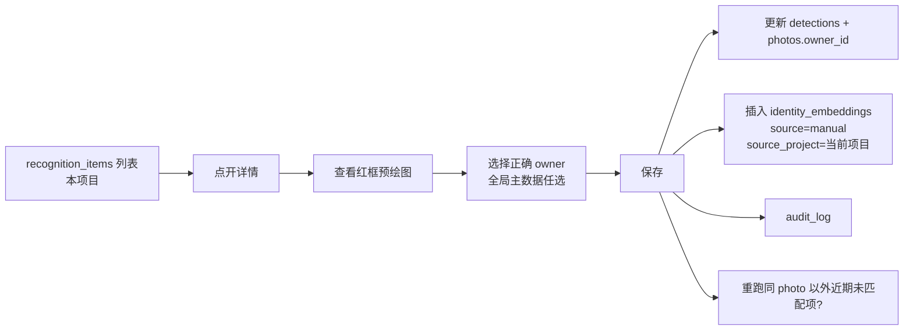

# 识别与自学习流水线

> v3：特征值库全局共享，kNN 跨项目匹配。照片可见性仍由项目控制（详见 [permissions.md](permissions.md)）。

## 1. 总体阶段

```
上传 → 预处理 → 检测 → Embedding → 角度 → 全局 kNN 匹配 → 决策 → 归档 → SSE 推送
```

所有阶段走后台 Worker，上传接口不阻塞。

## 2. 预处理

- 读取 `data/orig/{hash}.{ext}`。
- EXIF 旋转校正。
- 准备两个 tensor 输入：
  - 640×640 BGR float32，YOLOv8n 主体检测。
  - 原图另作人脸 SCRFD 输入（SCRFD 自带 letterbox）。

## 3. 检测分支

### 3.1 人脸 (target_type=face)

- 模型：`scrfd_500m_int8.onnx`。
- 输出：bbox + 5 landmark + score。
- 过滤：score ≥ 0.5，面积 ≥ 32×32。

### 3.2 工具 / 设备 (target_type=tool|device)

- 模型：`yolov8n_int8.onnx`，按项目级 `recognition.tool|device.classes` 设置限定类号。
- score ≥ 0.4、面积 ≥ 96×96 的主体框。
- 同图多主体按面积降序取前 N。

## 4. Embedding

### 4.1 人脸

- 5 landmark 仿射 → 112×112 → `mobilefacenet_arcface_int8.onnx` → 512 维 L2 归一化向量。

### 4.2 工具 / 设备

- bbox 外扩 10% → 224×224 → `dinov2_small_int8.onnx` → 384 → 线性映射到 512 → L2 归一化。
  - 映射矩阵随模型一起嵌入资源中，不随训练在线更新。
  - 选 512 维与人脸一致，pgvector 列类型统一。

## 5. 角度判定（人员）

### v1 启发式（默认）

- 由 SCRFD 5 landmark 计算 yaw。
- |yaw| < 25° → `front`
- 25° ≤ |yaw| < 70° → `side`
- |yaw| ≥ 70° → `back` 推断；无人脸但检到背影 → 后期分类器
- 未能判定 → `unknown`

### v2 训练后

- 使用 `models/angle_cls.onnx`，全局 / 项目设置 `recognition.angle.enabled=true` 后切换。

## 6. 匹配与决策

### 6.1 kNN（全局）

```sql
SELECT owner_type, owner_id, 1 - (embedding <=> $1) AS score
FROM identity_embeddings
WHERE owner_type = $2
ORDER BY embedding <=> $1
LIMIT 5;
```

- **不带 `project_id` 过滤**。同一员工在项目 A 训练过的特征值，项目 B 上传时可直接识别出来。
- 项目级覆盖仅限「阈值」、「是否启用某一识别」这类参数：`projects.overrides.match.threshold` 覆盖全局默认 `0.62`，但不改变候选集范围。
- top1.score ≡ 1 - cosine_distance。
- HNSW 全局，后接 owner_type 过滤；规模上去后可考虑 partial / partitioned index。

### 6.2 状态机

| top1 score | 状态 | 动作 |
|---|---|---|
| ≥ threshold | matched | 绑定全局 owner、归档、SSE matched |
| [low, threshold) | learning | 写一条 incremental embedding（全局表，带 `source_project=当前项目`）、SSE learning、归档 |
| < low | unmatched | 写 `recognition_items(unmatched)`（本项目）、SSE unmatched、不归档 |
| matched 且 ∈ [threshold, augment_upper) | matched + augment | 额外写一条 incremental embedding「补上不匹配那 10%」 |

增量写入细节：

```sql
INSERT INTO identity_embeddings (owner_type, owner_id, embedding, source, source_photo, source_project)
VALUES ($1, $2, $3, 'incremental', $4, $5);
-- source_project 为近期贡献该向量的项目仅供审计；不影响未来匹配。
```

### 6.3 冲突与调和

- 上传时用户已默认填 owner，但识别结果不一致：
  - 保留用户值，`detection.match_status = matched` 不覆盖 `photos.owner_id`。
  - 写一条 `recognition_items(suggested_owner_id, status=manual_corrected)` 给人工复核。
- 用户还未填、识别后才填：识别先 cache 到 `photos.owner_id`，用户保存时联动。
- 同 hash 在不同项目重复上传：各项目独立成行、独立归档；识别均能命中全局同一 owner。

## 7. 归档命名规则

```
data/archive/{project_code}/{wo_code_prefix3}/{YYYYMM}/{wo_code}_{owner_name}_{angle}_{seq:03}.{ext}
```

- `project_code`：来自 `projects.code`，避免跨项目同名工单冲突。
- `wo_code_prefix3`：`wo_code` 前 3 位，避免单目录过大。
- `owner_name`：取自全局 `persons.name` / `tools.name` / `devices.name`，去除不安全字符。
- `angle`：front / side / back，非人员为 `view`。
- `seq`：同 (project_id, wo_code, owner_id, angle) 的序号。
- 原 `path` 字段保留，归档路径写入 `archive_path`。

> 物理上同一员工的照片会散在多个 `{project_code}/` 目录下，这是预期行为（便于项目维度打包下载）。admin 可用「某员工跨项目照片」接口聊合查看。

## 8. 人工纠错闭环



- 选 owner 时是全局搜索（按姓名 / 员工号 / SN），不限项目。
- `action=create_and_bind` 仅 admin 可用；普通账号必须先联系管理员在全局主数据里建的人员。

## 9. 手动「快速建库」入口

- 主数据页（人员 / 工具 / 设备）admin 提供「快速建档」按钮：上传多张同一实体照 → 后端跑一轮检测/embedding → 创建身份 + 写多条 `identity_embeddings(source=initial, source_project=NULL)`。
- 这些 initial 向量不属于任何具体项目，在任何项目中都能被匹配。

## 10. 错误与重试

- Worker 抓取 `recognition_queue` 记录，失败 `attempts++`，超过 5 次记录错误进人工复查。
- 模型加载失败使服务处于 `not ready`，`/readyz` 返 503。
- 推理单次超时默认 30s，返回 `failed`。

## 11. 性能预期

- 单张（一人 + 一工具）：检测 ~150ms + face emb ~50ms + tool emb ~200ms = **~400ms**。
- 8 并发 worker、CPU 10C20T 环境，理论吞吐 ~50 photo/s，实际限于磁盘与 DB。
- 全局 HNSW + owner_type 过滤足够快；规模 < 10万向量下查询 < 5ms。

## 12. Precision / Recall baseline (milestone #2c — 2026-04-27 Asia/Shanghai)

First end-to-end Precision / Recall baseline against the real ONNX pipeline
(SCRFD det_500m + ArcFace w600k_mbf), using public face datasets. Face bucket
only at this milestone; tool / device P/R is deferred until a domain-specific
detector replaces YOLOv8n COCO (roadmap #5).

### Fixture

`tests/fixtures/face/baseline/` — 42 JPEGs / ~695 KiB / 12 enrolled identities
+ 3 distractor identities. Each enrolled identity has 1 seed photo + 2 query
photos; each distractor has 2 query photos.

| bucket             | source                                          | identities | per-id photos      | total |
| ------------------ | ----------------------------------------------- | ---------- | ------------------ | ----- |
| Western enrolled   | LFW funneled (sklearn `fetch_lfw_people`)       | 8          | 3 (1 seed + 2 q)   | 24    |
| Eastern enrolled   | jack139/face-dataset train2 (Asian celeb crops) | 4          | 3 (1 seed + 2 q)   | 12    |
| Western distractor | LFW funneled (held out)                         | 2          | 2 (query only)     | 4     |
| Eastern distractor | jack139/face-dataset train2 (held out)          | 1          | 2 (query only)     | 2     |
| **total**          |                                                 | **15**     |                    | **42** |

Eastern crops are bicubic-upscaled from native 140×147 to 256×256 to compensate
for low resolution. Provenance + sha256 + license metadata at
`tests/fixtures/face/baseline/MANIFEST.json`.

### Methodology

`tools/eval_pr.py`, driven by `packaging/scripts/recognition-pr-baseline.sh`:

1. Boot the server (release binary), log in, create project + WO.
2. Create 12 `persons` rows, upload each enrolled identity's seed photo as
   `owner_type=person` to seed `identity_embeddings(source='initial')`.
3. Drain queue. Upload all 30 query photos (24 enrolled + 6 distractor) as
   `owner_type=wo_raw` to the project's work-order. Drain queue.
4. Read `detections` per query photo via psql: top-1 `score` and
   `matched_owner_id` regardless of bucket (so we can replay thresholds
   off-line without re-running the model).
5. Replay `Hit::bucket(t)` over a threshold sweep
   `match_lower ∈ [0.40, 0.45, 0.50, 0.55, 0.60, 0.62, 0.65, 0.70, 0.75, 0.80]`
   with `low_lower = min(0.50, match_lower)` and compute P / R / F1 per bucket
   (Western / Eastern / overall).

Raw artefact: `docs/baselines/2c-recognition-pr.json`.

### Results at `Thresholds::DEFAULT { low=0.50, match=0.62 }`

| bucket      | n  | face_det_rate | TP | FP | FN | TN | P    | R     | F1     |
| ----------- | -- | ------------- | -- | -- | -- | -- | ---- | ----- | ------ |
| Western     | 20 | **1.0**       | 2  | 0  | 14 | 4  | 1.0  | 0.125 | 0.222  |
| Eastern     | 10 | **0.0**       | 0  | 0  | 8  | 2  | n/a  | 0.0   | n/a    |
| **overall** | 30 | 0.667         | 2  | 0  | 22 | 6  | 1.0  | 0.083 | 0.154  |

(`face_det_rate` = fraction of query photos where SCRFD returns ≥1 face. The
Eastern 0.0 is the dominant finding of this milestone; see below.)

### Threshold sweep (overall, all 30 query photos)

| match_lower    | TP | FP | FN | TN | P    | R     | F1        |
| -------------- | -- | -- | -- | -- | ---- | ----- | --------- |
| 0.40           | 8  | 0  | 16 | 6  | 1.0  | 0.333 | **0.500** |
| 0.45           | 7  | 0  | 17 | 6  | 1.0  | 0.292 | 0.452     |
| 0.50           | 6  | 0  | 18 | 6  | 1.0  | 0.250 | 0.400     |
| 0.55           | 3  | 0  | 21 | 6  | 1.0  | 0.125 | 0.222     |
| 0.60           | 2  | 0  | 22 | 6  | 1.0  | 0.083 | 0.154     |
| **0.62 (default)** | 2 | 0 | 22 | 6 | 1.0 | 0.083 | 0.154     |
| 0.65           | 2  | 0  | 22 | 6  | 1.0  | 0.083 | 0.154     |
| 0.70           | 0  | 0  | 24 | 6  | n/a  | 0.0   | n/a       |

### Score distributions

- Western enrolled-with-face top1_score (n = 16): min = 0.234,
  median = 0.400, max = 0.663.
- Western distractor top1_score (n = 4): max = **0.2612**.
- Clear separation gap: distractor max = 0.261 vs second-lowest enrolled
  correct = 0.293 → ~0.03 gap; with `match_lower = 0.40` the safety margin
  to distractor max grows to 0.14.

### Findings

1. **Eastern bucket: SCRFD detector fails on jack139/train2 crops.**
   `face_count = 0` on all 10 Eastern photos even after 256×256 bicubic
   upscaling. Same root-cause family as the StyleGAN domain-gap finding
   from milestone #2b. Eastern P / R is currently undefined; threshold
   calibration must rely on Western data alone until a higher-quality
   Asian face dataset is curated (CASIA-WebFace, glint_asia, or RMFD).
   Tracked as follow-up `#2c-asia`.
2. **Western recall at the current default is low (R = 0.125).** Only 2
   of 16 enrolled-with-face Western queries cross the
   `match_lower = 0.62` boundary. The sweep shows `match_lower = 0.40`
   triples TP (8 / 16) at preserved P = 1.0, yielding the best F1
   (0.500); distractors max at 0.261 leave a 0.14 safety margin.
3. **No false positives across the entire sweep.** All 4 Western
   distractor + 2 Eastern distractor query photos land in `unmatched`
   at every tested threshold ≥ 0.40. The strict default is therefore
   `precision-cheap, recall-expensive` against this dataset.

### Threshold decision

Defer to follow-up milestone `#2c-tune`: the data supports lowering
`match_lower` from 0.62 to 0.40 (or 0.50 conservatively), but with only
6 distractor queries and zero Eastern signal the false-positive rate
confidence interval is too wide for an immediate global default change.
The recommendation is queued for after `#2c-asia` widens the dataset.

`Thresholds::DEFAULT` is therefore **confirmed unchanged at
{ low_lower = 0.50, match_lower = 0.62, augment_upper = 0.95 }** for this
milestone, with a documented finding that lowering the bound is the
expected next step.

### Reproduce

```sh
sudo -u f1u bash -lc 'cd /root/F1-photo && bash packaging/scripts/recognition-pr-baseline.sh'
# Reads tests/fixtures/face/baseline/MANIFEST.json
# Writes /tmp/pr-baseline.json
# Archived run at docs/baselines/2c-recognition-pr.json
```
