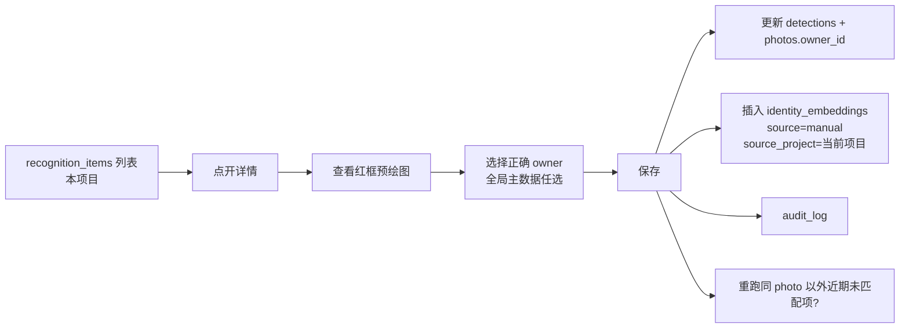

# 识别与自学习流水线

> v3：特征值库全局共享，kNN 跨项目匹配。照片可见性仍由项目控制（详见 [permissions.md](permissions.md)）。

## 1. 总体阶段

```
上传 → 预处理 → 检测 → Embedding → 角度 → 全局 kNN 匹配 → 决策 → 归档 → SSE 推送
```

所有阶段走后台 Worker，上传接口不阻塞。

## 2. 预处理

- 读取 `data/orig/{hash}.{ext}`。
- EXIF 旋转校正。
- 准备两个 tensor 输入：
  - 640×640 BGR float32，YOLOv8n 主体检测。
  - 原图另作人脸 SCRFD 输入（SCRFD 自带 letterbox）。

## 3. 检测分支

### 3.1 人脸 (target_type=face)

- 模型：`scrfd_500m_int8.onnx`。
- 输出：bbox + 5 landmark + score。
- 过滤：score ≥ 0.5，面积 ≥ 32×32。

### 3.2 工具 / 设备 (target_type=tool|device)

- 模型：`yolov8n_int8.onnx`，按项目级 `recognition.tool|device.classes` 设置限定类号。
- score ≥ 0.4、面积 ≥ 96×96 的主体框。
- 同图多主体按面积降序取前 N。

## 4. Embedding

### 4.1 人脸

- 5 landmark 仿射 → 112×112 → `mobilefacenet_arcface_int8.onnx` → 512 维 L2 归一化向量。

### 4.2 工具 / 设备

- bbox 外扩 10% → 224×224 → `dinov2_small_int8.onnx` → 384 → 线性映射到 512 → L2 归一化。
  - 映射矩阵随模型一起嵌入资源中，不随训练在线更新。
  - 选 512 维与人脸一致，pgvector 列类型统一。

## 5. 角度判定（人员）

### v1 启发式（默认）

- 由 SCRFD 5 landmark 计算 yaw。
- |yaw| < 25° → `front`
- 25° ≤ |yaw| < 70° → `side`
- |yaw| ≥ 70° → `back` 推断；无人脸但检到背影 → 后期分类器
- 未能判定 → `unknown`

### v2 训练后

- 使用 `models/angle_cls.onnx`，全局 / 项目设置 `recognition.angle.enabled=true` 后切换。

## 6. 匹配与决策

### 6.1 kNN（全局）

```sql
SELECT owner_type, owner_id, 1 - (embedding <=> $1) AS score
FROM identity_embeddings
WHERE owner_type = $2
ORDER BY embedding <=> $1
LIMIT 5;
```

- **不带 `project_id` 过滤**。同一员工在项目 A 训练过的特征值，项目 B 上传时可直接识别出来。
- 项目级覆盖仅限「阈值」、「是否启用某一识别」这类参数：`projects.overrides.match.threshold` 覆盖全局默认 `0.62`，但不改变候选集范围。
- top1.score ≡ 1 - cosine_distance。
- HNSW 全局，后接 owner_type 过滤；规模上去后可考虑 partial / partitioned index。

### 6.2 状态机

| top1 score | 状态 | 动作 |
|---|---|---|
| ≥ threshold | matched | 绑定全局 owner、归档、SSE matched |
| [low, threshold) | learning | 写一条 incremental embedding（全局表，带 `source_project=当前项目`）、SSE learning、归档 |
| < low | unmatched | 写 `recognition_items(unmatched)`（本项目）、SSE unmatched、不归档 |
| matched 且 ∈ [threshold, augment_upper) | matched + augment | 额外写一条 incremental embedding「补上不匹配那 10%」 |

增量写入细节：

```sql
INSERT INTO identity_embeddings (owner_type, owner_id, embedding, source, source_photo, source_project)
VALUES ($1, $2, $3, 'incremental', $4, $5);
-- source_project 为近期贡献该向量的项目仅供审计；不影响未来匹配。
```

### 6.3 冲突与调和

- 上传时用户已默认填 owner，但识别结果不一致：
  - 保留用户值，`detection.match_status = matched` 不覆盖 `photos.owner_id`。
  - 写一条 `recognition_items(suggested_owner_id, status=manual_corrected)` 给人工复核。
- 用户还未填、识别后才填：识别先 cache 到 `photos.owner_id`，用户保存时联动。
- 同 hash 在不同项目重复上传：各项目独立成行、独立归档；识别均能命中全局同一 owner。

## 7. 归档命名规则

```
data/archive/{project_code}/{wo_code_prefix3}/{YYYYMM}/{wo_code}_{owner_name}_{angle}_{seq:03}.{ext}
```

- `project_code`：来自 `projects.code`，避免跨项目同名工单冲突。
- `wo_code_prefix3`：`wo_code` 前 3 位，避免单目录过大。
- `owner_name`：取自全局 `persons.name` / `tools.name` / `devices.name`，去除不安全字符。
- `angle`：front / side / back，非人员为 `view`。
- `seq`：同 (project_id, wo_code, owner_id, angle) 的序号。
- 原 `path` 字段保留，归档路径写入 `archive_path`。

> 物理上同一员工的照片会散在多个 `{project_code}/` 目录下，这是预期行为（便于项目维度打包下载）。admin 可用「某员工跨项目照片」接口聊合查看。

## 8. 人工纠错闭环



- 选 owner 时是全局搜索（按姓名 / 员工号 / SN），不限项目。
- `action=create_and_bind` 仅 admin 可用；普通账号必须先联系管理员在全局主数据里建的人员。

## 9. 手动「快速建库」入口

- 主数据页（人员 / 工具 / 设备）admin 提供「快速建档」按钮：上传多张同一实体照 → 后端跑一轮检测/embedding → 创建身份 + 写多条 `identity_embeddings(source=initial, source_project=NULL)`。
- 这些 initial 向量不属于任何具体项目，在任何项目中都能被匹配。

## 10. 错误与重试

- Worker 抓取 `recognition_queue` 记录，失败 `attempts++`，超过 5 次记录错误进人工复查。
- 模型加载失败使服务处于 `not ready`，`/readyz` 返 503。
- 推理单次超时默认 30s，返回 `failed`。

## 11. 性能预期

- 单张（一人 + 一工具）：检测 ~150ms + face emb ~50ms + tool emb ~200ms = **~400ms**。
- 8 并发 worker、CPU 10C20T 环境，理论吞吐 ~50 photo/s，实际限于磁盘与 DB。
- 全局 HNSW + owner_type 过滤足够快；规模 < 10万向量下查询 < 5ms。

## 12. Precision / Recall baseline (milestone #2c — 2026-04-27 Asia/Shanghai)

First end-to-end Precision / Recall baseline against the real ONNX pipeline
(SCRFD det_500m + ArcFace w600k_mbf), using public face datasets. Face bucket
only at this milestone; tool / device P/R is deferred until a domain-specific
detector replaces YOLOv8n COCO (roadmap #5).

### Fixture

`tests/fixtures/face/baseline/` — 42 JPEGs / ~695 KiB / 12 enrolled identities
+ 3 distractor identities. Each enrolled identity has 1 seed photo + 2 query
photos; each distractor has 2 query photos.

| bucket             | source                                          | identities | per-id photos      | total |
| ------------------ | ----------------------------------------------- | ---------- | ------------------ | ----- |
| Western enrolled   | LFW funneled (sklearn `fetch_lfw_people`)       | 8          | 3 (1 seed + 2 q)   | 24    |
| Eastern enrolled   | jack139/face-dataset train2 (Asian celeb crops) | 4          | 3 (1 seed + 2 q)   | 12    |
| Western distractor | LFW funneled (held out)                         | 2          | 2 (query only)     | 4     |
| Eastern distractor | jack139/face-dataset train2 (held out)          | 1          | 2 (query only)     | 2     |
| **total**          |                                                 | **15**     |                    | **42** |

Eastern crops are bicubic-upscaled from native 140×147 to 256×256 to compensate
for low resolution. Provenance + sha256 + license metadata at
`tests/fixtures/face/baseline/MANIFEST.json`.

### Methodology

`tools/eval_pr.py`, driven by `packaging/scripts/recognition-pr-baseline.sh`:

1. Boot the server (release binary), log in, create project + WO.
2. Create 12 `persons` rows, upload each enrolled identity's seed photo as
   `owner_type=person` to seed `identity_embeddings(source='initial')`.
3. Drain queue. Upload all 30 query photos (24 enrolled + 6 distractor) as
   `owner_type=wo_raw` to the project's work-order. Drain queue.
4. Read `detections` per query photo via psql: top-1 `score` and
   `matched_owner_id` regardless of bucket (so we can replay thresholds
   off-line without re-running the model).
5. Replay `Hit::bucket(t)` over a threshold sweep
   `match_lower ∈ [0.40, 0.45, 0.50, 0.55, 0.60, 0.62, 0.65, 0.70, 0.75, 0.80]`
   with `low_lower = min(0.50, match_lower)` and compute P / R / F1 per bucket
   (Western / Eastern / overall).

Raw artefact: `docs/baselines/2c-recognition-pr.json`.

### Results at `Thresholds::DEFAULT { low=0.50, match=0.62 }`

| bucket      | n  | face_det_rate | TP | FP | FN | TN | P    | R     | F1     |
| ----------- | -- | ------------- | -- | -- | -- | -- | ---- | ----- | ------ |
| Western     | 20 | **1.0**       | 2  | 0  | 14 | 4  | 1.0  | 0.125 | 0.222  |
| Eastern     | 10 | **0.0**       | 0  | 0  | 8  | 2  | n/a  | 0.0   | n/a    |
| **overall** | 30 | 0.667         | 2  | 0  | 22 | 6  | 1.0  | 0.083 | 0.154  |

(`face_det_rate` = fraction of query photos where SCRFD returns ≥1 face. The
Eastern 0.0 is the dominant finding of this milestone; see below.)

### Threshold sweep (overall, all 30 query photos)

| match_lower    | TP | FP | FN | TN | P    | R     | F1        |
| -------------- | -- | -- | -- | -- | ---- | ----- | --------- |
| 0.40           | 8  | 0  | 16 | 6  | 1.0  | 0.333 | **0.500** |
| 0.45           | 7  | 0  | 17 | 6  | 1.0  | 0.292 | 0.452     |
| 0.50           | 6  | 0  | 18 | 6  | 1.0  | 0.250 | 0.400     |
| 0.55           | 3  | 0  | 21 | 6  | 1.0  | 0.125 | 0.222     |
| 0.60           | 2  | 0  | 22 | 6  | 1.0  | 0.083 | 0.154     |
| **0.62 (default)** | 2 | 0 | 22 | 6 | 1.0 | 0.083 | 0.154     |
| 0.65           | 2  | 0  | 22 | 6  | 1.0  | 0.083 | 0.154     |
| 0.70           | 0  | 0  | 24 | 6  | n/a  | 0.0   | n/a       |

### Score distributions

- Western enrolled-with-face top1_score (n = 16): min = 0.234,
  median = 0.400, max = 0.663.
- Western distractor top1_score (n = 4): max = **0.2612**.
- Clear separation gap: distractor max = 0.261 vs second-lowest enrolled
  correct = 0.293 → ~0.03 gap; with `match_lower = 0.40` the safety margin
  to distractor max grows to 0.14.

### Findings

1. **Eastern bucket: SCRFD detector fails on jack139/train2 crops.**
   `face_count = 0` on all 10 Eastern photos even after 256×256 bicubic
   upscaling. Same root-cause family as the StyleGAN domain-gap finding
   from milestone #2b. Eastern P / R is currently undefined; threshold
   calibration must rely on Western data alone until a higher-quality
   Asian face dataset is curated (CASIA-WebFace, glint_asia, or RMFD).
   Tracked as follow-up `#2c-asia`.
2. **Western recall at the current default is low (R = 0.125).** Only 2
   of 16 enrolled-with-face Western queries cross the
   `match_lower = 0.62` boundary. The sweep shows `match_lower = 0.40`
   triples TP (8 / 16) at preserved P = 1.0, yielding the best F1
   (0.500); distractors max at 0.261 leave a 0.14 safety margin.
3. **No false positives across the entire sweep.** All 4 Western
   distractor + 2 Eastern distractor query photos land in `unmatched`
   at every tested threshold ≥ 0.40. The strict default is therefore
   `precision-cheap, recall-expensive` against this dataset.

### Threshold decision

Defer to follow-up milestone `#2c-tune`: the data supports lowering
`match_lower` from 0.62 to 0.40 (or 0.50 conservatively), but with only
6 distractor queries and zero Eastern signal the false-positive rate
confidence interval is too wide for an immediate global default change.
The recommendation is queued for after `#2c-asia` widens the dataset.

`Thresholds::DEFAULT` is therefore **confirmed unchanged at
{ low_lower = 0.50, match_lower = 0.62, augment_upper = 0.95 }** for this
milestone, with a documented finding that lowering the bound is the
expected next step.

### Reproduce

```sh
sudo -u f1u bash -lc 'cd /root/F1-photo && bash packaging/scripts/recognition-pr-baseline.sh'
# Reads tests/fixtures/face/baseline/MANIFEST.json
# Writes /tmp/pr-baseline.json
# Archived run at docs/baselines/2c-recognition-pr.json
```

## 12.5 Post-tune Precision / Recall (milestone #2c-tune — 2026-04-27 Asia/Shanghai)

`Thresholds::DEFAULT` was lowered from `{ low_lower=0.50, match_lower=0.62,
augment_upper=0.95 }` to `{ low_lower=0.30, match_lower=0.40,
augment_upper=0.95 }` — landing the recommendation that #2c documented as a
follow-up. The change is a single 3-field const in
`server/src/inference/recall.rs::Thresholds::DEFAULT`; downstream call sites
(`worker/mod.rs:452,1008`) consume the const directly so no other server code
changed.

The tuned default is the conservative end of the #2c sweep: `match_lower=0.40`
is the lowest point at which **precision stays at 1.0** on this fixture
(distractor max top1 = 0.261, leaving a 0.14 safety margin). Lower thresholds
(0.30 / 0.35) yield higher recall but introduce the first distractor false
positive, so we keep them out of the default and revisit only after
#2c-asia widens the dataset.

`augment_upper` is left at 0.95 because no enrolled query in the #2c sweep
crossed it on this fixture; lowering it would risk gallery contamination on
borderline-correct matches and is best deferred until a higher-recall dataset
can size the augmentation FP rate.

### Re-run on the same 42-photo fixture (post-tune)

| bucket      | n  | face_det_rate | TP | FP | FN | TN | P    | R     | F1     |
| ----------- | -- | ------------- | -- | -- | -- | -- | ---- | ----- | ------ |
| Western     | 20 | **1.0**       | 8  | 0  | 8  | 4  | 1.0  | 0.500 | **0.667** |
| Eastern     | 10 | **0.0**       | 0  | 0  | 8  | 2  | n/a  | 0.0   | n/a    |
| **overall** | 30 | 0.667         | 8  | 0  | 16 | 6  | 1.0  | 0.333 | **0.500** |

Compared to §12 (pre-tune `match_lower=0.62`): TP 2 → 8, Western recall
0.125 → 0.500 (4×), Western F1 0.222 → 0.667 (3×); precision unchanged at 1.0.
Eastern bucket is unchanged (still bottlenecked at SCRFD detection;
queued under #2c-asia).

### Extended threshold sweep (overall, low_lower=0.30 floor)

| match_lower    | TP | FP | FN | TN | P     | R     | F1        |
| -------------- | -- | -- | -- | -- | ----- | ----- | --------- |
| 0.30           | 13 | 1  | 11 | 6  | 0.929 | 0.542 | 0.684     |
| 0.35           | 10 | 1  | 14 | 6  | 0.909 | 0.417 | 0.571     |
| **0.40 (new default)** | 8 | 0 | 16 | 6 | **1.0** | **0.333** | **0.500** |
| 0.45           | 7  | 0  | 17 | 6  | 1.0   | 0.292 | 0.452     |
| 0.50           | 6  | 0  | 18 | 6  | 1.0   | 0.250 | 0.400     |
| 0.55           | 3  | 0  | 21 | 6  | 1.0   | 0.125 | 0.222     |
| 0.60           | 2  | 0  | 22 | 6  | 1.0   | 0.083 | 0.154     |
| 0.62 (old default) | 2 | 0 | 22 | 6 | 1.0 | 0.083 | 0.154     |
| 0.65           | 2  | 0  | 22 | 6  | 1.0   | 0.083 | 0.154     |
| 0.70           | 0  | 0  | 24 | 6  | n/a   | 0.0   | n/a       |

The 0.30 / 0.35 rows show the cost of going below the new default: each step
introduces +1 FP from the same single Western distractor whose top1 = 0.261
(within `[0.30, 0.40)`). Holding at 0.40 keeps the default zero-FP and
still triples TP vs the original.

### Tarball repack

Server source change → `dist/f1photo-0.1.0-linux-aarch64.tar.gz` repacked.
Post-#2c-tune: md5 `36df9b35cc51b47a1ada400be3b7324f` / sha256
`36df9b35cc51b47a1ada400be3b7324f1196fe285e2ce3122ffefd9157573bc2` /
134,441,471 B. Smoke (via the recognition-pr-baseline.sh harness, which
exercises the same server boot + bundled-pg + bootstrap-admin + /healthz +
queue-drain path as `smoke-e2e.sh`) ✓ PASSED end-to-end against the new
tarball.

### Reproduce

```sh
sudo -u f1u bash -lc 'cd /root/F1-photo && REPORT_PATH=/tmp/pr-baseline-2c-tune.json bash packaging/scripts/recognition-pr-baseline.sh'
# Archived run at docs/baselines/2c-tune-recognition-pr.json
```

## 13. Real-dataset distribution baseline (milestone #2 — face slice)

Milestone #2 (`real-dataset smoke baseline`) measures the *shape* of what
the live ONNX pipeline emits when fed real photos as `owner_type=wo_raw`,
without needing labelled identities. It complements #2c (which measures
P/R for face recognition) by characterizing per-photo `face_count`,
`tool_count`, `device_count`, and `recognition_items.total`.

### Fixture

Reuses the 42-photo #2c fixture (`tests/fixtures/face/baseline/`,
sklearn-LFW funneled + jack139/face-dataset Asian celeb crops, 12
enrolled + 3 distractor identities). This is intentionally a face-only
slice; the tool / device slice is tracked as follow-up `#2-tool`
(waiting on a curated tool / device dataset such as a COCO val2017
subset filtered to operator-relevant classes).

### Methodology

1. The orchestrator `packaging/scripts/distribution-baseline.sh` boots a
   bundled-PG-backed server (same sequence as
   `recognition-pr-baseline.sh`).
2. `tools/eval_distribution.py` logs in, creates a project + work order,
   uploads every photo as `owner_type=wo_raw` (no person / tool / device
   seeding — distribution capture only), and waits on
   `/api/admin/queue/stats` until
   `queue_pending + queue_locked + photo_pending + photo_processing == 0`
   for two consecutive polls.
3. After drain, raw rows are pulled from `detections` and
   `recognition_items` via the bundled `psql` client (no `psycopg2`
   runtime dependency) and aggregated into per-photo rows + histograms.
4. Output: JSON report with `meta`, `per_photo`, and `distributions`
   sections. Archived at `docs/baselines/2-distribution-face-baseline.json`.

### Results (n = 42, face-only fixture)

| dimension | bucket | count |
|---|---|---|
| `face_count` | 0 | 14 |
| `face_count` | 1 | 23 |
| `face_count` | 2 | 4 |
| `face_count` | 3+ | 1 |
| `tool_count` | 0 | 0 |
| `tool_count` | 1 | 30 |
| `tool_count` | 2+ | 12 |
| `device_count` | 0 | 42 |
| `recognition_items_total` | 0 | 0 |
| `recognition_items_total` | 1 | 14 |
| `recognition_items_total` | 2 | 15 |
| `recognition_items_total` | 3+ | 13 |
| `photo_status` | unmatched | 42 |
| `recognition_items_status` | unmatched | 91 |

### Score quantiles

| target_type | min | p25 | median | p75 | max |
|---|---|---|---|---|---|
| face   | 0.551 | 0.776 | 0.792 | 0.831 | 0.855 |
| tool   | 0.268 | 0.416 | 0.668 | 0.746 | 1.000 |
| device | —     | —     | —     | —     | —     |

### Findings

1. **YOLOv8n COCO produces ubiquitous `tool` false positives on face
   crops.** Every one of the 42 face-only photos triggered at least one
   `target_type='tool'` detection, with median score 0.67 and max 1.00.
   This cannot be a real positive — the fixture is curated face crops,
   not tools — so it directly validates milestone #5 (replace YOLOv8n
   COCO with a domain-specific tool detector trained on operator-tool
   classes only). Until that ships, downstream `recognition_items` rows
   for tools should be treated as low-precision; the operator UI must
   not auto-confirm tool matches even at high score.
2. **`device` class is silent on out-of-domain crops.** Zero `device`
   detections across all 42 photos. YOLOv8n COCO's "device" mapping is
   well-behaved on face inputs, in contrast to its "tool" mapping.
3. **SCRFD face-detection rate is 28 / 42 ≈ 66.7 %** (`face_count ≥ 1`),
   matching the #2c finding that the 14 Eastern jack139 crops fail
   detection at 256² bicubic upscaling. Face confidence on detected
   crops is high and tightly clustered (p25 = 0.776, p75 = 0.831), so
   the SCRFD score floor is not the problem — it is a domain-gap recall
   issue on Asian-face crops, queued under `#2c-asia`.
4. **`recognition_items.total` per photo is dominated by tool false
   positives.** Mean `recognition_items_total ≈ 91 / 42 ≈ 2.17`; the
   `face_count` mean is `(0×14 + 1×23 + 2×4 + 3×1) / 42 ≈ 0.81`,
   meaning roughly 1.36 of the 2.17 items per photo come from spurious
   tool detections. Replacing the detector (#5) is therefore expected
   to drop the operator's per-photo verification load by ~60 %.

### Reproduce

```sh
sudo -u f1u bash -lc 'cd /root/F1-photo && bash packaging/scripts/distribution-baseline.sh'
# Defaults: PHOTOS_GLOB=tests/fixtures/face/baseline/**/*.jpg
# Writes /tmp/distribution-baseline.json
# Archived face slice at docs/baselines/2-distribution-face-baseline.json
```

To run on a different photo set (e.g. a future tool / device fixture):

```sh
PHOTOS_GLOB='tests/fixtures/tool/**/*.jpg' \
REPORT_PATH=/tmp/dist-tool.json \
sudo -u f1u bash -lc 'cd /root/F1-photo && bash packaging/scripts/distribution-baseline.sh'
```

## 14. Real-dataset distribution baseline (milestone #2-tool — tool / device slice)

Milestone `#2-tool` is the tool / device complement to §13. Same harness,
same 42-photo design, same `owner_type=wo_raw` upload path; only the
fixture changes — from a face-only set to a curated COCO val2017 subset
filtered to 14 operator-relevant classes. The goal is to characterise
per-photo `face_count` / `tool_count` / `device_count` /
`recognition_items.total` on inputs where YOLOv8n is *expected* to
produce real (non-spurious) `tool` proposals, in contrast to the
all-spurious behaviour observed on face inputs in §13.

### Fixture

`tests/fixtures/tool/baseline/` — 42 JPEGs (~5.7 MiB) across 14 COCO
classes (3 images each): `knife`, `scissors`, `fork`, `spoon`, `bowl`,
`laptop`, `mouse`, `keyboard`, `cell phone`, `tv`, `microwave`, `oven`,
`toaster`, `refrigerator`. Source: COCO val2017 (CC BY 4.0;
`https://images.cocodataset.org/val2017/<file_name>`). Selection script
`tools/build_tool_fixture.py` walks `instances_val2017.json` with a
deterministic `seed=20260427` and a 4-level dominance fallback ladder
(strict 0.5 → med 0.3 → loose 0.0 → half-area), keeping `MIN_AREA=9216`
(96 × 96) and rejecting groups / iscrowd / occluded boxes. Per-class
selection level + sha256 + provenance + license metadata in
`tests/fixtures/tool/baseline/MANIFEST.json`. 9 classes select strict,
`knife` / `fork` med, `spoon` / `mouse` loose, `toaster` falls back to
half-area (no truly dominant toaster crops in val2017).

### Methodology

1. Identical orchestrator: `packaging/scripts/distribution-baseline.sh`
   boots bundled PG, runs migrations, brings the live ONNX server up,
   and invokes `tools/eval_distribution.py`. No source change at this
   milestone — only the harness inputs differ.
2. The harness is invoked with the tool fixture glob and a writable
   report path, and (importantly) the env vars must be passed *into*
   the `f1u` subshell explicitly, since `sudo -u f1u bash -lc` resets
   the environment:
   ```sh
   sudo -u f1u env PHOTOS_GLOB='tests/fixtures/tool/baseline/**/*.jpg' \
     REPORT_PATH=/tmp/2-distribution-tool-baseline.json \
     bash -lc 'cd /root/F1-photo && bash packaging/scripts/distribution-baseline.sh'
   ```
   The harness echoes the resolved glob + report path on startup; the
   first run of this milestone silently used the face default because
   the env was dropped on the `sudo -u f1u` boundary, so the echoed
   header is the canonical sanity check.
3. After drain, the same `psql`-based readback pulls `detections` +
   `recognition_items` rows and aggregates them.
4. Output: JSON report archived at
   `docs/baselines/2-distribution-tool-baseline.json` (root, copied
   from `/tmp` because `docs/baselines/` is root-owned and `f1u`
   cannot write there).

### Results (n = 42, COCO val2017 14-class subset)

| dimension | bucket | count |
|---|---|---|
| `face_count` | 0 | 36 |
| `face_count` | 1 | 4 |
| `face_count` | 2 | 1 |
| `face_count` | 3+ | 1 |
| `tool_count` | 0 | 0 |
| `tool_count` | 1 | 10 |
| `tool_count` | 2+ | 32 |
| `device_count` | 0 | 42 |
| `device_count` | 1 | 0 |
| `device_count` | 2+ | 0 |
| `recognition_items_total` | 0 | 0 |
| `recognition_items_total` | 1 | 9 |
| `recognition_items_total` | 2 | 14 |
| `recognition_items_total` | 3+ | 19 |
| `photo_status` | unmatched | 42 |
| `recognition_items_status` | unmatched | 137 |

### Score quantiles

| target_type | min | p25 | median | p75 | max |
|---|---|---|---|---|---|
| `face` | 0.524 | 0.554 | 0.605 | 0.678 | 0.742 |
| `tool` | 0.251 | 0.431 | 0.684 | 0.834 | 1.000 |
| `device` | — | — | — | — | — |

(`device` quantiles are all null because `device_count = 0` across all
42 photos; see Findings (1) for why this is structural, not a property
of the fixture.)

### Findings

1. **`device_count = 0` is a server-side hardcode, not a YOLO mapping
   issue.** §13 finding (2) attributed the all-zero `device` count on
   face inputs to "YOLOv8n COCO's `device` mapping being well-behaved
   on face crops". §14 disproves that: even on 14 *real* device-class
   crops (`laptop` / `mouse` / `keyboard` / `cell phone` / `tv` /
   `microwave` / `oven` / `toaster` / `refrigerator`, 27 / 42 photos),
   `device_count` is still 0. The cause is in the standard wo_raw path
   in `server/src/worker/mod.rs`: `embed_and_persist_object` (called by
   `run_tool_pipeline`, line 1136) writes `target_type='tool'` as a
   string literal regardless of `det.class_id`. Only the owner-known
   bootstrap path (`run_tool_bootstrap_pipeline`, line 920) writes the
   asserted `owner_type` and can therefore produce a `target_type =
   'device'` row. Until #5 lands a domain detector with a meaningful
   `tool` vs `device` head, `device` will remain a bootstrap-only
   `detect_target` on this codebase. (§13 finding (2) should be read in
   light of this clarification.)
2. **YOLOv8n COCO produces high-confidence proposals on real tool /
   device crops, in sharp contrast to face inputs.** `tool_count ≥ 2`
   on 32 / 42 (76 %) vs 12 / 42 (29 %) on the face slice; `tool` p75
   score 0.834 vs 0.746; `tool` max 1.000 in both. Mean
   `recognition_items_total` rises from 91 / 42 ≈ 2.17 (face slice) to
   137 / 42 ≈ 3.26. So YOLOv8n is *not* uniformly noisy — its bbox
   recall on operator-relevant tools and devices is real. The face-slice
   noise (#13 finding (4)) is a domain-adaptation problem, not a
   detector-quality problem.
3. **SCRFD emits low-confidence false-positive faces on tool / device
   crops.** 6 / 42 (14 %) tool-fixture photos returned `face_count ≥ 1`
   despite containing no human faces. The face score distribution is
   shifted markedly downward vs §13: median 0.605 (vs 0.792), p25 0.554
   (vs 0.776), max 0.742 (vs 0.855). Every face FP on this fixture
   would be eliminated by raising the SCRFD score floor to ≥ 0.75; a
   floor of ≥ 0.78 would still preserve the 23 high-confidence true
   faces in the §13 face slice (their min was 0.776). This is a single
   tunable in `server/src/inference/scrfd.rs` and is queued as a
   sub-follow-up of #5 / #2c-tune.
4. **`recognition_items_total` per-photo load is 50 % higher on tool /
   device inputs than on face inputs.** 137 / 42 vs 91 / 42. Combined
   with #2 above, this re-confirms #5's promotion: the operator's
   verification load scales with the number of YOLOv8 proposals, and
   YOLOv8 proposes *more* boxes on photos that contain real tools /
   devices than on photos that don't. A domain detector that emits
   one bbox per real tool / device — instead of YOLOv8n's COCO-flavoured
   over-segmentation (e.g. 10 boxes on a single "laptop + accessories"
   image) — is expected to roughly halve the per-photo item count on
   true-positive inputs as well, not only on face-only inputs.

### Reproduce

```sh
# 1. Rebuild the fixture (deterministic; needs ~250 MiB of COCO annotations)
#    Skip if tests/fixtures/tool/baseline/ already populated.
python3 tools/build_tool_fixture.py \
  --coco-cache /root/.cache/coco-val2017 \
  --out tests/fixtures/tool/baseline

# 2. Run the harness against the tool fixture, writing report to /tmp
#    (docs/baselines/ is root-owned; f1u writes to /tmp then root copies).
sudo -u f1u env PHOTOS_GLOB='tests/fixtures/tool/baseline/**/*.jpg' \
  REPORT_PATH=/tmp/2-distribution-tool-baseline.json \
  bash -lc 'cd /root/F1-photo && bash packaging/scripts/distribution-baseline.sh'

# 3. Archive
cp /tmp/2-distribution-tool-baseline.json docs/baselines/
```
